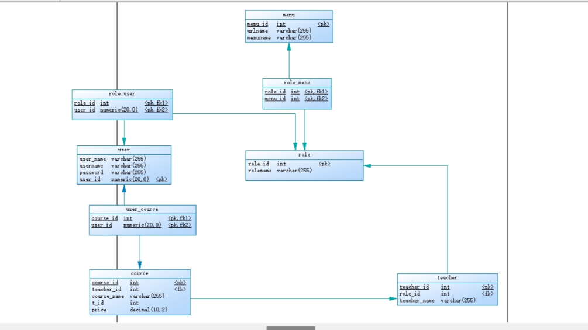
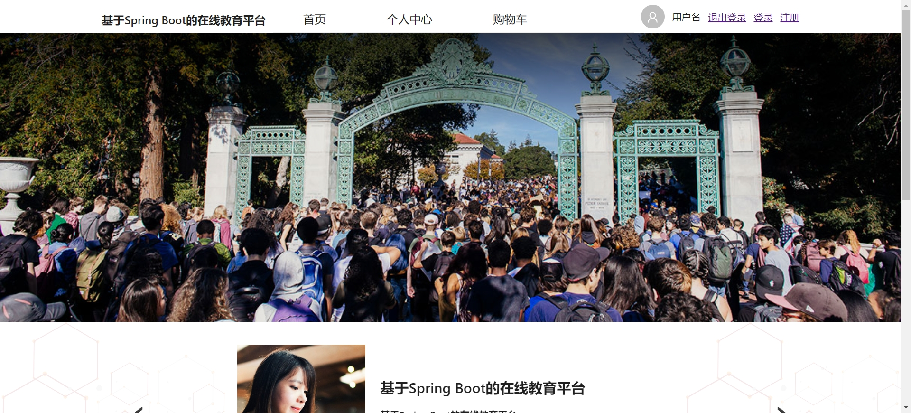
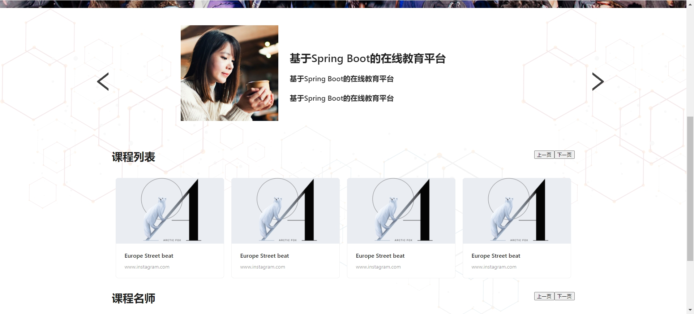
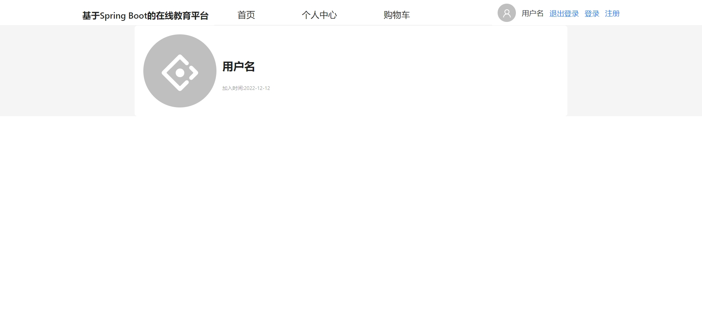
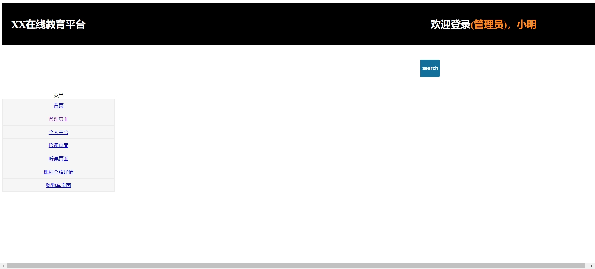
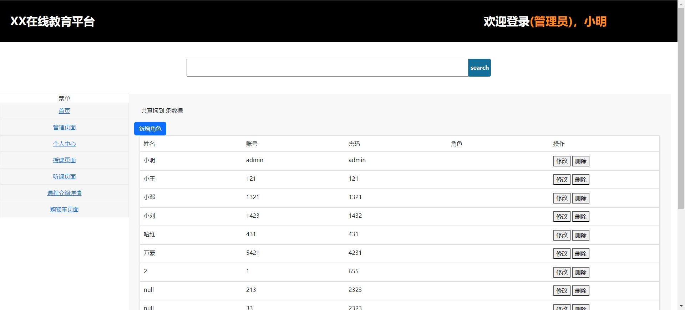

# education-system
## 说明
education-system项目是基于```React+Redis+Spring Boot+Mysql```实现的，前后端分离的在线教育平台，如果该项目对您有帮助，您可以点一下右上角的"star" 支持一下 谢谢!

或者可以"follow"一下,该项目会一直持续更新,不断添加新功能和优化

该项目仅用于学习，没有任何商业用途，如有侵权，立即删除。


## 项目描述
### 项目介绍
本项目基于```Spring Boot```框架，前端采用```React```以及```Jquery```实现，```Redis```作为缓存数据库用于，Mysql作为储存数据库
主要分为在线教育平台系统以及在线教育平台的管理系统，其中在线教育平台前端由React实现。在线教育平台的管理系统
前端由原生```HTML+CSS+JavaScript+Jquery```实现，在线教育平台系统仍处在开发中，在线教育平台的管理系统以及基本开发完毕。


### 技术栈

* ```Spring Boot```
* ```MyBatis```
* ```Jquery```
* ```react```
* ```antd```

## 项目搭建与运行


### 后台环境搭建
#### 环境的搭建
- 安装```JDK 8```或者更高的版本,程序中用到了```java 8```中的函数式编程的一些东西
- 安装```Mysql 5.7```及以上
- 安装```Maven```,安装```Redis```,
- ```application.properties```中的数据库配置需要变成自己的配置
##### 开发环境
- 可直接在 ```IntelliJ IDEA```进行二次开发

### 前台环境搭建
#### 环境的搭建
- 安装node.js，配置好环境变量
- ```npm install```
##### 开发环境
- 可直接在 ```VSCode```进行二次开发


### 功能
- [x] 首页展示
- [x] 登录
- [x] 注册
- [x] 权限分离
- [x] JWT
- [x] 管理员对用户的增删查
- [ ] 管理员修改个人信息
- [ ] 用户查看和修改个人信息
- [ ] 购物车功能
- [ ] 购买课程功能
- [ ] 在线学习功能


### 模块

- 登陆注册模块
   - 用户登录
   - 用户注册
   - JWT
   - 权限分离
   - 请求拦截 


- 首页展示模块
   - 数据库数据动态展示（只前端展示静态页面，待完善）
   - 轮播图


- 个人信息模块
  - 查看个人信息（只前端展示部分静态页面，待完善）


- 管理员管理模块
  - 对用户的增删查
### 数据库展示



### 页面展示
在线教育平台首页






在线教育平台登录


在线教育平台注册


在线教育平台个人信息页(开发中)



在线教育平台管理系统登录


在线教育平台管理系统首页



在线教育平台管理系统用户管理页



## 说明
本项目仍处在开发早期，仍有许多功能没有实现和完善，大部分功能较为简陋，本人将在后续对项目进行完善。


